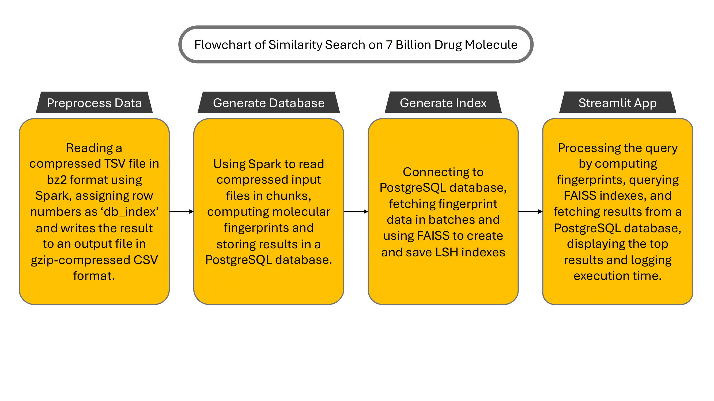
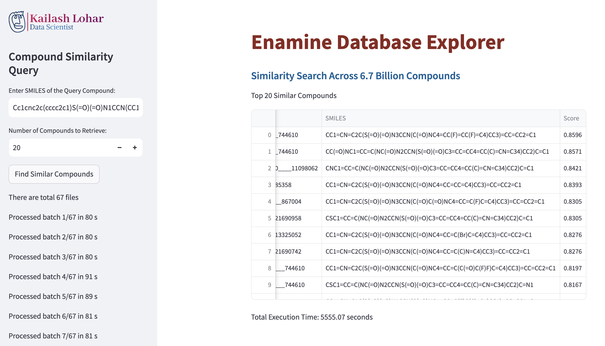

# Enamine Database Explorer

Enamine Database Explorer is a powerful tool designed to search for similar compounds within the extensive Enamine dataset, consisting of 6.7 billion compounds. This project utilizes Apache Spark, PostgreSQL, and Streamlit to provide a robust and interactive platform for compound similarity search with a tanimoto similarity on 1024 bits.

## Features

- **Similarity Search**: Efficiently search for compounds similar to a given query compound using Tanimoto similarity.
- **Apache Spark Integration**: Leverage the power of Apache Spark for large-scale data processing.
- **PostgreSQL Database**: Store and manage compound data in a PostgreSQL database.
- **Interactive Streamlit App**: User-friendly web interface for querying and visualizing results.

## Project Structure

- `Makefile`: Scripts to build and manage Docker containers.
- `devops`: Directory containing Docker configurations for JupyterLab, PostgreSQL, and Streamlit.
  - `docker-compose.yml`: Docker Compose configuration file.
  - `jupyterlab`: Contains Dockerfile and environment configuration for JupyterLab.
  - `postgresql`: Contains Dockerfile for PostgreSQL.
  - `streamlit`: Contains Dockerfile and Streamlit configuration.
- `main`: The main directory contains Jupyter notebooks for data preprocessing (1_preprocess.ipynb) and vector operations (2_vector_ops.ipynb) and a Streamlit application (streamlit_app.py). It also includes the z_main_files subdirectory, which holds additional scripts and resources necessary for the project.

## Docker Setup and Usage
Note: Make sure you have Docker installed on your system.
1.  Clone the repository to your local machine: `git@github.com:KailashLohar/Similarity-Search.git`

2.  Navigate to the project directory "**Similarity-Search**" and run the following commands to build the Docker image :`make build-image`

3.  Start the container using command: `make start-container`

4.  Enter the Spark Container using command: `make enter-spark-container`

5.  Enter the PostgreSQL Container using command: `make enter-pg-container`

6.  Enter the Streamlit Container using command: `make enter-sl-container`

7.  Stop and remove all containers using command: `make stop-container`

## Pipeline Instruction
Once you are inside Spark container, you have to execute two notebooks to get the final outputs , "1_preprocess", "2_vector_ops" simultaneously.

### Instruction for running "1_preprocess":

1.  `Make a small subset`:This step creates a "simulation_files" directory if it doesn't exist, then reads up to 1,000,001 lines from a compressed data file and writes them to a new file in the created directory, finally printing a success message.
   
2.  `Convert bz2 to gz format`:This step converts a compressed file to a gzipped CSV using Spark, measures the time taken, and logs it. It sets file paths, runs the conversion script with spark-submit, deletes the original file, and saves the elapsed time in minutes to a text file. The Spark script processes the file and writes the output as a gzipped CSV.

### Instruction for running "2_vector_ops":
1.  `Generate Database`:
 - This step starts by creating a directory named "simulation_files" to store output files and logs, and sets up paths for the output database file and a log file to record the elapsed time. It then runs a Spark job using spark-submit to execute the generate_db.py script, which processes the input file in batches, computes fingerprints for chemical structures, and writes the processed data to a PostgreSQL database.

- The code records the start and end times of the Spark job, calculates the total elapsed time in minutes, and writes this time to a log file within the "simulation_files" directory. The generate_db.py script reads the input file, skipping lines already processed, and divides the data into chunks.

- For each chunk, it generates fingerprints using RDKit's Morgan fingerprint algorithm, adds a 'db_index' column, and writes the data to a PostgreSQL table named fingerprints_table. The script handles errors, logs processing times for each chunk, and ensures the database is updated with the new data, while also cleaning up temporary files after each batch is processed.

2.  `Generate Index`: 
- The code starts by creating a directory named "simulation_files" to store output files and logs, setting up paths for the output index file and a log file to record the elapsed time. It then runs a Spark job using spark-submit to execute the generate_index.py script, which processes the data in batches to create an index using FAISS (Facebook AI Similarity Search).

- The code records the start and end times of the Spark job, calculates the total elapsed time in minutes, and writes this time to a log file within the "simulation_files" directory. The generate_index.py script reads the input data from a PostgreSQL database, processes it in batches, and creates an LSH (Locality-Sensitive Hashing) index using FAISS. It handles data in chunks and writes intermediate index files periodically.

- For each batch, the script processes rows from the database, extracts vectors and their IDs, and adds them to the LSH index. It periodically saves the index to a file and records the last processed index to ensure continuity in case of interruptions. The script also logs processing times for each batch and ensures the index is updated and saved correctly.

3.  `Explanation of Streamlit app`: 
- This  provides a Streamlit application for performing similarity searches across a large compound database using FAISS and RDKit. It starts by defining several functions for querying the FAISS index, computing Tanimoto similarity between chemical structures, and processing individual index files to retrieve similar compounds.

- The process_similarity_query function handles the overall query by computing the fingerprint of the query compound, iterating through the index files to find the top similar compounds, and aggregating the results into a DataFrame. It uses PostgreSQL to fetch the corresponding chemical structures from the database based on the indices retrieved from FAISS.

- The Streamlit interface allows users to input the SMILES string of a query compound and specify the number of similar compounds to retrieve. When the user submits the query, the application connects to the PostgreSQL database, processes the query using the defined functions, and displays the top similar compounds along with their Tanimoto similarity scores.

- The application also logs the processing time for each batch of indices and the total execution time for the query, providing real-time feedback to the user through the Streamlit sidebar. It uses RDKit to generate fingerprints and compute similarity, FAISS for efficient similarity search, and pandas for data handling and displaying the results.

## Running the Streamlit App
Once the containers are running, you can access the Streamlit app in your web browser. The app provides an interface to enter the SMILES notation of a query compound and retrieve similar compounds from the database.

## Author
- Kailash Lohar  <kailashlohariitkgp@gmail.com>

## License

This project is licensed under the MIT License - see the LICENSE file for details.

